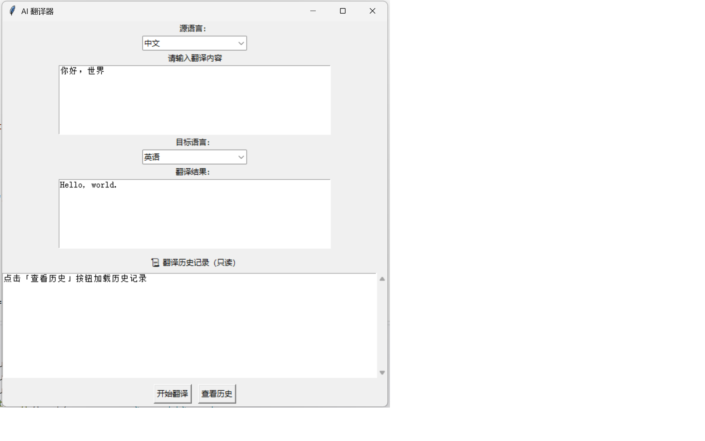

# AI Translator

基于 Python 和 DeepSeek API 开发的 AI 翻译工具，支持命令行模式（CLI）和 Tkinter 图形界面模式（GUI）。

适合需要快速进行中英互译、查看翻译历史的用户。

---

## ✨ 项目功能

- ✅ 中文 → 英文翻译
- ✅ 英文 → 中文翻译
- ✅ 基于 DeepSeek API
- ✅ 命令行交互模式（CLI）
- ✅ Tkinter 图形界面模式（GUI）
- ✅ 保存翻译历史
- ✅ 应用日志记录
- ✅ API Key 使用环境变量配置
- ✅ 翻译失败时显示明确错误信息
- ✅ 支持自动化测试

---

## 🖥️ 项目截图



---

## 🛠️ 技术栈

| 技术 | 用途 |
| --- | --- |
| Python 3.11 | 项目主要开发语言 |
| DeepSeek API | 提供 AI 翻译服务 |
| OpenAI SDK | 调用 DeepSeek API |
| Tkinter | 创建图形界面 |
| python-dotenv | 加载环境变量 |
| unittest | 自动化测试 |
| logging | 应用日志记录 |

---

## 📋 环境要求

- Python 3.11 或更高版本
- 有效的 DeepSeek API Key
- 能够访问 DeepSeek API 的网络环境

---

## 🚀 快速开始

### 1. 克隆项目

```bash
git clone https://github.com/neverholdm/ai-translator.git
cd ai-translator
```

### 2. 创建虚拟环境（推荐）

Windows：

```powershell
python -m venv .venv
.venv\Scripts\Activate.ps1
```

macOS / Linux：

```bash
python3 -m venv .venv
source .venv/bin/activate
```

### 3. 安装依赖

```bash
pip install -r requirements.txt
```

### 4. 配置 API Key

将 `.env.example` 重命名为 `.env`：

```text
.env.example → .env
```

然后编辑 `.env` 文件，将占位符替换为你自己的 API Key：

```ini
DEEPSEEK_API_KEY=your_api_key_here
```

请不要删除或提交真实 API Key。`.env.example` 是配置模板，`.env` 只用于本地配置。

---

## ▶️ 使用方法

### 命令行模式（CLI）

```bash
python main.py
```

启动后，根据菜单提示选择：

```text
1. 开始翻译
2. 管理历史记录
3. 退出
```

### 图形界面模式（GUI）

```bash
python gui.py
```

GUI 支持：

- 输入待翻译文本
- 选择源语言
- 选择目标语言
- 查看翻译结果
- 查看、搜索、删除和清空翻译历史
- 导出翻译历史为 CSV

---

## 🧪 运行测试

```bash
python -m unittest
```

测试使用 Mock，不会调用真实 API；历史记录测试使用临时 SQLite 数据库，不会访问本机真实历史。

---

## 📁 项目结构

```text
ai-translator/
├── main.py                  # 命令行程序入口
├── gui.py                   # Tkinter 图形界面
├── translate.py             # 翻译核心逻辑
├── translate_history.py     # 翻译历史记录管理
├── logger.py                # 日志配置
├── test_translate.py        # 自动化测试
├── requirements.txt         # Python 依赖
├── assets/
│   └── gui.png              # GUI 截图
├── .env.example             # API 配置示例
├── .env                    # 本地 API 配置，不提交到 Git
└── app.log                  # 本地运行日志，不提交到 Git
```

---

## ❓ 常见问题

### 没有配置 API Key

请确认已经将 `.env.example` 重命名为 `.env`，并在 `.env` 中填写自己的 API Key：

```ini
DEEPSEEK_API_KEY=your_api_key_here
```

### API Key 无效

请检查 API Key 是否正确、是否已经失效，以及账户是否有可用额度。

### 网络请求失败

请检查当前网络、DeepSeek API 的访问情况以及 API 服务状态。

### 翻译历史保存在哪里

成功的翻译记录会保存到本机用户数据目录中的 SQLite 数据库：

- Windows：`%LOCALAPPDATA%\AiTranslator\history.sqlite3`
- macOS：`~/Library/Application Support/AiTranslator/history.sqlite3`
- Linux：`$XDG_DATA_HOME/AiTranslator/history.sqlite3`；未设置时为 `~/.local/share/AiTranslator/history.sqlite3`

数据库在首次保存或查看历史时创建，不会写入项目源码目录。已有的 `translation_history.txt` 不会被读取、修改或自动迁移。

在 CLI 的“管理历史记录”菜单或 GUI 的历史按钮区，可以查看、按关键词搜索、删除单条、清空以及导出 CSV。导出使用 UTF-8 BOM 编码，便于 Excel 识别中文；为防止误覆盖，目标 CSV 已存在时会拒绝导出。

---

## 🔐 安全说明

- `.env.example` 只包含 API Key 占位符，可以提交到 GitHub
- `.env` 只保存在本地，不要提交到 GitHub
- 不要公开或分享自己的 API Key
- 不要把真实 API Key 写入代码
- 不要提交 `app.log`、`history.sqlite3`、导出的 CSV 等本地生成文件
- 使用本项目产生的 API 费用由使用者自行承担

---

## 🗺️ 后续计划

- [ ] 支持更多语言
- [ ] 优化 GUI 界面
- [ ] 提供 Windows 可执行文件
- [ ] 增加更多自动化测试
- [ ] 支持更多 AI 模型和服务商

---

## 📄 License

本项目基于 MIT License 开源，详见 [LICENSE](LICENSE) 文件。

---

## 👤 作者

GitHub：

https://github.com/neverholdm
